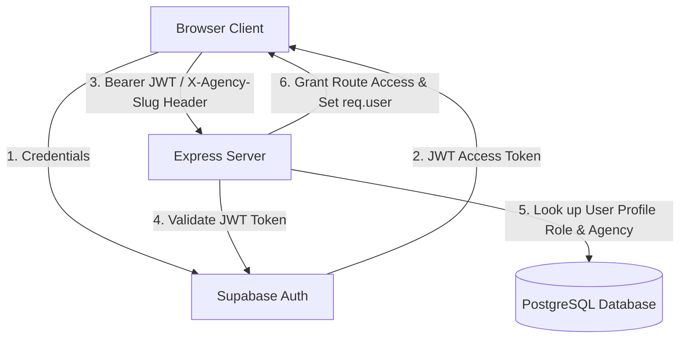

# Lumen Analytics - Authentication & Permissions Audit

This document examines how user identities are authenticated, how user roles are defined, and how these constraints translate into database permissions.

---

## 1. Authentication Flow

Lumen Analytics uses a hybrid authentication model:

1. **Token Retrieval**: The React client uses the Supabase Auth SDK to submit email/password credentials to the Supabase authentication endpoint. Supabase returns a JSON Web Token (JWT).
2. **Client Storage**: The access token is stored in the browser's application state.
3. **API Requests**: The client intercepts requests using `authFetch` to inject two headers:
   - `Authorization: Bearer <access_token>`
   - `X-Agency-Slug: <slug>` (identifying the white-label branding context)
4. **Server Verification**: The custom Express server decodes the token on protected routes by calling `supabase.auth.getUser(token)`.

---

## 2. User Roles and Contexts

The Express backend evaluates authentication headers to place requests into one of four context states:

| Role Context | Identification Mechanism | Read Privileges | Write Privileges | Target Scope |
| :--- | :--- | :--- | :--- | :--- |
| **Platform Administrator** | Authenticated User + `profiles.is_admin = true` | Global (All tables, all rows) | Global (All tables, all rows) | Bypasses all tenant limitations and client limits. |
| **Agency Operator** | Authenticated User + `profiles.agency_id` set | Tenant Scope (Only their agency's rows) | Tenant Scope (Limited by `client_limit` in `agencies` table) | Restricted to managing their own clients, settings, and metrics. |
| **Public Dashboard Reader** | Unauthenticated request + `X-Agency-Slug` header | Tenant Scope (Only the matching agency's rows) | None (Mutations blocked by global read-only middleware) | Read-only white-label dashboard for clients or agency prospects. |
| **Public Demo Fallback** | Unauthenticated request (no headers/token) | Default Scope (Hardcoded "Ignite PPC Group" agency data) | None (Mutations blocked by global read-only middleware) | Allows instant demonstration access without credentials. |

---

## 3. Client-Side Authentication Hook

The frontend client configures its API communicator in [supabaseClient.ts](file:///c:/Users/pejos/OneDrive/Desktop/Anti/src/lib/supabaseClient.ts#L14-L30) via the `authFetch` wrapper.

- `authFetch` automatically appends the Bearer token and the agency slug to outgoing headers.
- If the Express server responds with a `401 Unauthorized` (indicating the session has expired), the wrapper automatically signs the user out of Supabase to refresh the UI state.
- During public white-label sessions (`globalSession.agencySlug` is set), the automatic sign-out on 401 is bypassed since the session relies on public read-only headers rather than active user credentials.
