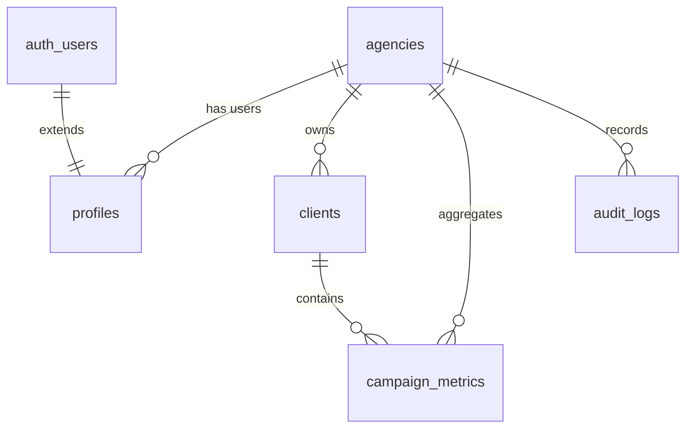

# Lumen Analytics - Multi-Tenant Architecture Audit

This document explains the multi-tenant data isolation design of Lumen Analytics. It details the relational database mappings, isolation enforcement mechanisms, and potential security vectors.

---

## 1. Database Entity Relationships

Lumen Analytics models tenancy using a hierarchical relational model:



- **`public.agencies`**: The core tenant.
- **`public.profiles`**: Associated with one agency via `agency_id`. Maps directly to a record in Supabase Auth `auth.users`.
- **`public.clients`**: Represents a marketing client account. Bound to an agency via `agency_id`.
- **`public.campaign_metrics`**: Daily platform statistics. Bound to a client via `client_id` and an agency via `agency_id` (enforced by trigger).
- **`public.audit_logs`**: System event history. Bound to an agency via `agency_id`.

---

## 2. Multi-Tenant Isolation Mechanisms

Data isolation is implemented in two parallel enforcement layers:

### Layer A: Database Row-Level Security (RLS)
For all direct database traffic initiated from the client-side SDK, the Postgres engine evaluates RLS policies:
- A user authenticated as Agency A has `profiles.agency_id = 'agency-a-uuid'`.
- When querying `clients` or `campaign_metrics`, the policy verifies:
  ```sql
  EXISTS (
      SELECT 1 FROM profiles 
      WHERE profiles.id = auth.uid() 
        AND profiles.agency_id = clients.agency_id
  )
  ```
- This ensures that users can only select, insert, update, or delete rows associated with their own agency ID.

### Layer B: Express API Controller Guards
Since the custom backend Express server uses the `SUPABASE_SERVICE_ROLE_KEY` to connect, it operates with absolute database privileges (bypassing RLS). The Express server must enforce tenant isolation programmatically:
- **Verifying Ownership**: Prior to performing mutations or serving metrics, the server queries the database to inspect the record's parent agency ID:
  ```typescript
  const { data: currentClient } = await supabase
    .from("clients")
    .select("agency_id")
    .eq("id", id)
    .single();

  if (!user.isAdmin && currentClient.agency_id !== user.agencyId) {
    return res.status(403).json({ error: "Access Denied" });
  }
  ```

### Layer C: Automatic Tenant Association (Database Trigger)
To prevent orphan metrics from leaking or being misallocated, a database trigger `trg_backfill_campaign_metrics_agency_id` executes BEFORE INSERT or UPDATE on `campaign_metrics`.
- If an API integration (e.g. Windsor.ai) pushes metrics containing a `client_id` but no `agency_id`, the trigger automatically resolves the correct `agency_id` from the parent `clients` record.

---

## 3. Security Concerns & Vulnerabilities

Three architectural risks have been identified in the multi-tenant isolation model:

### Risk 1: Express Server-Role Key Bypass
Because the Express server bypasses database-level RLS entirely by using the `service_role` key, a single coding omission in a server controller route (e.g. forgetting to check `currentClient.agency_id === user.agencyId`) would allow an authenticated user from Agency A to read, modify, or delete records belonging to Agency B.

### Risk 2: White-Label Slug Spoofing
The white-label read-only dashboard feature authenticates requests using the `X-Agency-Slug` header. Since agency slugs are public strings (e.g. `ignite-ppc` or `demo-agency`), an attacker can spoof this header:
- By setting `X-Agency-Slug: target-agency-slug` in their request headers, an unauthenticated caller is granted read-only access to all clients, daily campaign charts, and campaign metrics of the target agency.
- **Remediation**: White-label public dashboards must be secured using unique, unguessable secure tokens or hashed slugs (e.g. UUIDs) rather than sequential or guessed slugs.

### Risk 3: Public Fallback Leakage
The server's fallback authentication logic automatically maps unauthenticated requests to the "Ignite PPC Group" agency dataset. While useful for trial sessions, if a coding error in frontend routing causes headers to be omitted, sensitive system queries could fallback to default public-demo views, exposing demo agency data.
